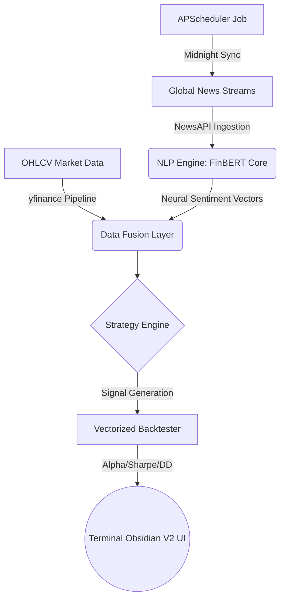

# 💠 SENTIRA PRO // Institutional Sentiment Terminal
> **The Neural Pulse of Global Markets.**

[](https://github.com/Hemex-32/Sentira/graphs/commit-activity)
[](LICENSE.txt)
[](https://www.python.org/)
[](https://streamlit.io/)

**Sentira PRO** is a production-grade automated intelligence platform designed for institutional-level market analysis. It decodes the semantic delta of financial news using state-of-the-art transformer models, maps those vectors to real-time price action, and executes sub-second vectorized backtests to quantify strategy alpha.

---

## 🏛️ The "Terminal Obsidian" Design System

Sentira PRO is built on the **Terminal Obsidian V2** framework—an industrial-utilitarian interface designed for high-density information environments.

- **Structural Precision**: A rigid 8px mathematical spacing grid.
- **Fluid Typography**: Dynamic scaling via `Space Grotesk` (Branding) and `JetBrains Mono` (Technical Data).
- **Mechanical Haptics**: Hardware-inspired `steps(4)` motion dynamics for physical interface feedback.
- **Blueprint Background**: High-contrast OLED black with a 30px technical blueprint grid.
- **Instrument Cluster Navigation**: A fixed global navigation panel with active-state hardware highlighting.

---

## 🧬 Technical Architecture



### 🧠 AI Intelligence Layer
The core utilizes **FinBERT** (Financial BERT), a pre-trained NLP model specifically fine-tuned for financial sentiment analysis. Unlike general sentiment models, FinBERT understands the nuanced vocabulary of finance—deciphering the difference between a "bullish run" and a "bullish trap" with institutional accuracy.

### ⚡ Execution Engine
- **Vectorized Logic**: Leveraging `backtesting.py` for sub-second strategy evaluation across historical datasets.
- **Automated Synchronization**: Integrated `scheduler.py` ensures your local dataset is synchronized with global markets every midnight.
- **Live Ticker Synergy**: A real-time market scroller injecting active sentiment vectors directly into the price stream.

---

## 🛠️ Installation & Deployment

### 1. Zero-to-Terminal Setup
```bash
# Clone the institutional core
git clone https://github.com/Hemex-32/Sentira.git
cd Sentira

# Initialize isolated environment
python -m venv .venv
source .venv/bin/activate  # Windows: .venv\Scripts\activate

# Install precision dependencies
pip install -r requirements.txt
```

### 2. Control Unit Configuration
Create a `.env` file in the root directory:
```env
NEWS_API_KEY=your_institutional_key
DEFAULT_TICKERS=AAPL,MSFT,NVDA,TSLA,BTC-USD
LOOKBACK_DAYS=30
BUY_THRESHOLD=0.1
SELL_THRESHOLD=-0.1
```

### 3. Launching the Platform
**To start the Interactive Terminal:**
```bash
streamlit run dashboard/app.py
```

**To start the Daily Automation Engine:**
```bash
python scheduler.py
```

---

## 📊 Evaluation Metrics
Sentira PRO provides an exhaustive performance audit for every asset:
- **Return [%]**: Cumulative strategy growth.
- **Buy & Hold Return**: Baseline market comparison.
- **Sharpe Ratio**: Risk-adjusted returns.
- **Max Drawdown**: peak-to-trough decline quantification.
- **Win Rate**: Probability of successful signal execution.

---

## 🚧 Limitations & Disclaimers
*   **Institutional Sandbox**: This is a paper-trading agent designed for educational and research purposes.
*   **Not Financial Advice**: Past neural performance is not indicative of future market results.
*   **API Constraints**: Free tier users are limited by NewsAPI's 1-month lookback period.

---

## 🤝 Contributing
As an open-source maintainer, I welcome pull requests that align with the **Terminal Obsidian** design philosophy and technical precision of the FinBERT core.

1. Fork the repo.
2. Create your feature branch (`git checkout -b feature/AlphaEngine`).
3. Commit changes (`git commit -m 'feat: Enhance vector precision'`).
4. Push to branch (`git push origin feature/AlphaEngine`).
5. Open a Pull Request.

---

## ⚖️ License
Distributed under the **MIT License**. See `LICENSE.txt` for more information.

---
<p align="center">
  <b>SENTIRA // CORE</b><br>
  Institutional Trading Intelligence
</p>
